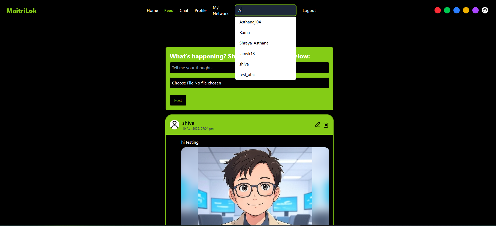
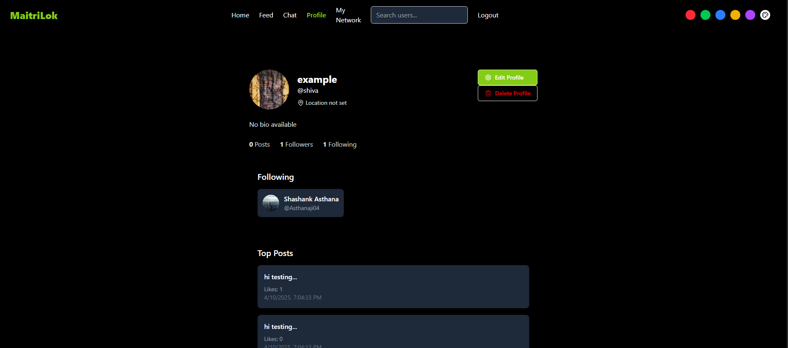
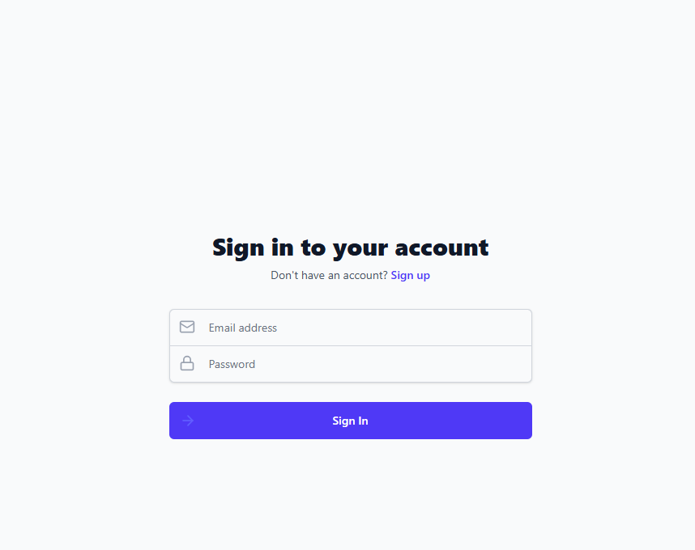
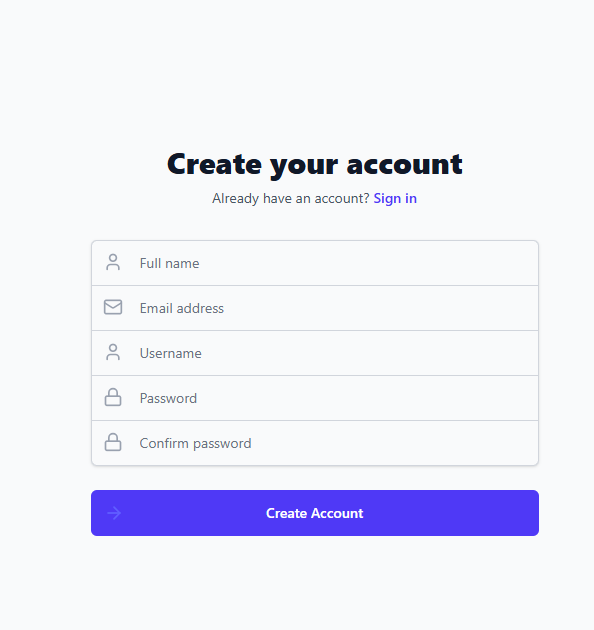

# 🌐 Maitrilok - A Social Media Universe

**Maitrilok** is a full-featured social media platform crafted with the MERN stack. It empowers users to connect, share, and interact in real-time through a secure and scalable architecture. Designed with role-based features and modern microservices, Maitrilok ensures an intuitive and responsive social experience.

---

# ⚠ All the reports of different phases are in `Reports` Folder



See More ...





---

## 🛠️ Tech Stack

| Layer           | Technologies Used                       |
|----------------|------------------------------------------|
| Frontend       | React.js, Tailwind CSS                   |
| Backend        | Node.js, Express.js                      |
| Authentication | jwt                                      |
| Database       | MongoDB Atlas                            |
| Image Storage  | FireBase                                 |
| CI/CD          | GitHub Actions                           |

---

---

## 📂 Project Structure

```
└── 📁myapp v3
    └── 📁backend
        └── .env
        └── 📁config
            └── db.js
        └── 📁controllers
            └── chatController.js
            └── postController.js
            └── userController.js
        └── 📁middleware
            └── authMiddleware.js
            └── uploadMiddleware.js
        └── 📁models
            └── Chats.js
            └── index.js
            └── Post.js
            └── Story.js
            └── User.js
        └── package-lock.json
        └── package.json
        └── 📁routes
            └── authRoutes.js
            └── chatRoutes.js
            └── index.js
            └── postRoutes.js
            └── userRoutes.js
        └── server.js
        └── 📁uploads
            └── Images 
    └── 📁dataconnect
    └── 📁public
        └── vite.svg
    └── 📁src
        └── App.css
        └── App.jsx
        └── 📁components
            └── 📁Auth
                └── Login.jsx
                └── Logout.jsx
                └── SignUp.jsx
            └── 📁Chat
                └── ChatList.jsx
                └── ChatWIndow.jsx
                └── MessageInput.jsx
            └── 📁Feed
                └── CreatePost.jsx
                └── CreateStory.jsx
                └── Post.jsx
                └── Story.jsx
            └── 📁Navbar
                └── Footer.jsx
                └── NavBar.jsx
            └── 📁Profile
                └── EditProfile.jsx
                └── OtherUserProfile.jsx
                └── UserProfile.jsx
            └── 📁Search
                └── SearchBar.jsx
            └── 📁UI
                └── Loading.jsx
        └── 📁contexts
            └── AuthContext.jsx
            └── ThemeContext.jsx
        └── firebaseConfig.js
        └── index.css
        └── main.jsx
        └── 📁pages
            └── ChatPage.jsx
            └── Feed.jsx
            └── Home.jsx
            └── MyNetwork.jsx
            └── ThemeSwitcher.jsx
        └── 📁utils
            └── api.js
    └── .firebaserc
    └── .gitignore
    └── eslint.config.js
    └── firebase-debug.log
    └── firebase.json
    └── index.html
    └── package-lock.json
    └── package.json
    └── README.md
    └── storage.rules
    └── tailwind.config.js
    └── vite.config.js
```
# Contributors
- https://github.com/Asthanaji05
- https://github.com/Shreya-Asthana
